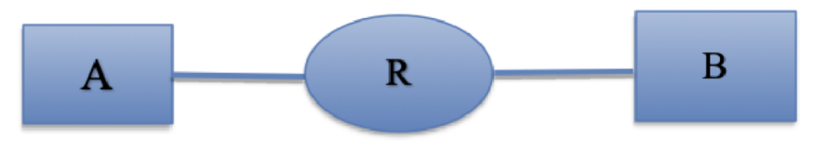

# GoBackN-Protocol

[Go-Back-N](https://en.wikipedia.org/wiki/Go-Back-N_ARQ) is a specific instance of the [automated repeat request (ARQ)](https://en.wikipedia.org/wiki/Automatic_repeat_request) and a special case of the general sliding window protocol. 

## How this works?

The network topology used for this projects is as follows:



Sender A, reads content from `test/francais.txt` and sends them to the router R in chunks of size 1500 bytes (specified in `defs.hpp`). Router R, either buffers or drops the received chunk. After some simulated processing time, it forwards them to B. Upon receival (:-?), receiver B sends an acknowledgment (ACK) for each packet received. 
Sender A, detects if a packet is dropped by the router using some mechanism, and re-transmits as specified in the Go-Back-N protocol. 


## How to run?

Make sure you are in the main directory of the repository. 

### Sender 
```shell    
$ make run_sender
``` 

### Router
```shell
$ make run_router 
```

### Receiver
```shell
$ make run_receiver
```

In order to start the sending process, you have to enter an arbitrary string in the sender's terminal.  

A report in full details can be found in `doc/`. 

🥛🍪